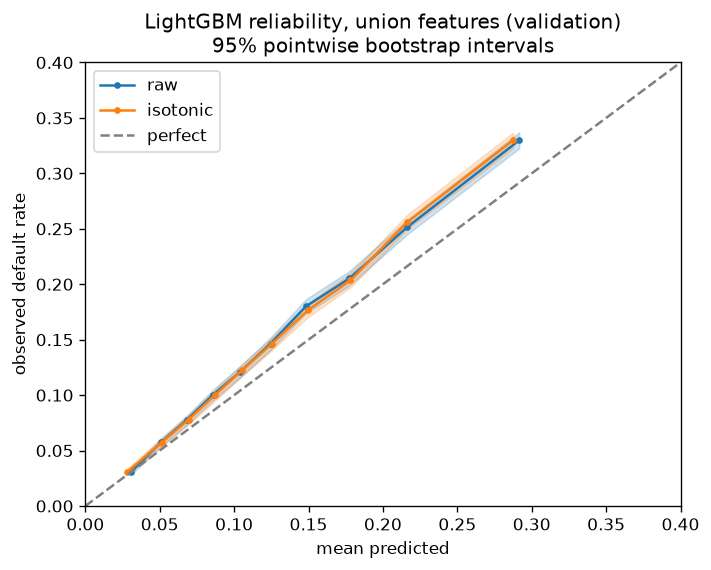
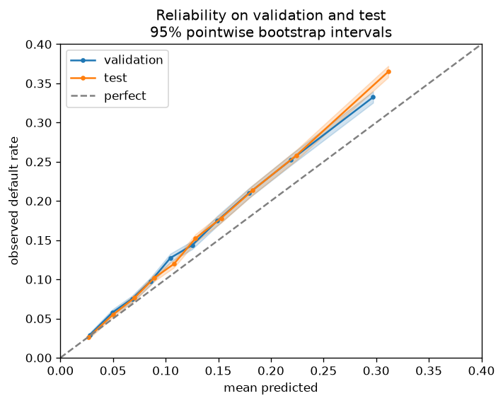

# Credit risk on Lending Club

[](https://github.com/EnzoCanonero/credit-risk-end-to-end/actions/workflows/ci.yml)

Default-risk models for Lending Club's 36-month loans, built from what a lender knows at
origination. The project runs three questions in sequence: whose information actually prices a
loan, whether the model's probabilities are honest enough to act on, and what a lending decision
made on them is worth in money.

`int_rate` and `grade` are Lending Club's own verdict on each loan. A borrower-only model leaves
them out, to weigh the applicant data on its own; the union model adds them back. Everything trains
on the oldest vintages and is judged on newer ones.

## What's here

The target is lifetime default on 36-month loans, and a loan is labelled only once it has run its
full term. Without that maturity filter recent vintages would look artificially safe, their
defaults not yet arrived; the filter is applied in SQL when the modelling table is built.

Leakage is held off in two layers. SQL keeps post-origination columns, payments, recoveries, last
FICO, out of the modelling table. Python then splits the remaining fields into borrower data and
Lending Club's verdict, giving three feature sets to compare: the verdict on its own, the borrower
data on its own (the underwriter model, which excludes `int_rate` and `grade` by construction), and
the union of the two. The split is out-of-time throughout: train on the oldest vintages, tune on
the middle, test on the most recent, holding 375k, 155k and 178k loans.

## Results

The model is a union LightGBM, borrower data and Lending Club's verdict together. That set beat
either one on its own when the three were compared on validation ([Whose information prices the
loan](#whose-information-prices-the-loan), below), so it is the one carried forward: tuned with
Optuna, refit on train and validation, and scored on the held-out test once, its only look at
those newest vintages. It orders risk out of sample at least as well as validation suggested:

| union lgbm         | ROC AUC | PR AUC | Brier | log-loss |
|--------------------|:-------:|:------:|:-----:|:--------:|
| validation (tuned) | 0.699   | 0.279  | 0.120 | 0.392    |
| test               | 0.710   | 0.303  | 0.121 | 0.395    |

Priced on realised outcomes, three decision rules, approve everything, one break-even threshold for
the whole book, or approve on each loan's own expected profit, come out close, and the simplest is
the best (the rules and the economics behind them are under [What a decision is
worth](#what-a-decision-is-worth), below):

| policy            | total profit | approved | bad rate |
|-------------------|:------------:|:--------:|:--------:|
| approve all       | 124.9M       | 178,453  | 0.155    |
| single break-even | 129.9M       | 171,292  | 0.144    |
| expected profit   | 126.5M       | 177,203  | 0.155    |

On a book already screened to Lending Club's accepted loans the approve-or-reject decision is worth
only a few percent, and a single threshold set on the training book captures it. Per-loan pricing
does worse because it trusts probabilities that lean low on the newest vintage and approves
high-rate loans that default at 41%.

### Calibration

The economics multiply by the predicted probability, so honest probabilities are a prerequisite,
not a nicety. On validation the union model is already well calibrated, and no post-hoc correction
is applied.



On the test set it underpredicts across the range: the newest vintage defaults more than the
training years, and a model fit on older data does not fully see it. The drift is small, but it is
exactly what tips per-loan pricing behind the blunter single threshold above.



## Data layer

The work sits in two layers. This one, in `sql/`, prepares and interrogates the data; the notebooks
below do the modelling. The files are numbered in groups:

- **`ingest`, `01`** load the raw CSVs into DuckDB and build the modelling table: the lifetime-default
  target, the maturity filter, and the leakage exclusions that keep post-origination columns out.
- **`02`–`05`** stand behind that table: data-quality guards, the evidence that recent vintages are
  not yet observable (status mix and default maturation), and the out-of-time split cutoffs.
- **`10`–`12`** are portfolio context: what a Lending Club grade encodes, how originations and bad
  rates moved over time, and how defaults accumulate as each vintage ages.
- **`20`** is the feature EDA behind the underwriter feature list, distributions, outliers, and each
  field's link to default.
- **`30`** is the loan economics: interest earned on repaid loans, principal lost on defaults, and
  the two constants the decision layer prices with.

### AWS analytical parity

The cloud layer preserves the local data contract rather than creating a second analytical truth.
Curated `v1` stores 2,260,668 unique loans in S3 as 12 Snappy Parquet files partitioned by source
snapshot and issue year. The Glue Data Catalog registers their schema and partition locations;
Athena queries the files in place through an external table.

[`scripts/run_athena_analysis.py`](scripts/run_athena_analysis.py) executes the same four SQL files
in DuckDB and Athena, disables Athena result reuse, and writes a small metrics file only if every
ordered value matches. In the recorded Athena engine v3 run, every query matched. The rate-band
economics scanned 20.01 MiB, 5.38% of the 390,019,161-byte curated dataset, and the training-book
constants scanned 6.60 MiB, 1.78%. These are measured scan shares from explicit Parquet projection
and Hive partition predicates, not an inferred savings claim.

> Reproduced the credit-risk economics on Athena with exact DuckDB parity while scanning 5.38% of
> curated bytes for the portfolio rate-band analysis and 1.78% for training constants.

The analysis also makes the censoring decision visible: the unresolved share of recent 60-month
loans rises from 17.15% for the 2014 vintage to 90.01% for 2018, so their resolved-only bad rate is
not a lifetime-default target. See the [full parity and scan report](reports/athena/2018Q4_v1.md),
the [shared Athena SQL](sql/athena/), and the [catalog bootstrap notes](infra/aws/athena/README.md).

## Studies

The result above sits on five notebooks, each one question, in the order they build. Every one
trains on the training vintages and is measured on validation; the test set stays sealed until the
last.

- [`21_underwriter_vs_lc`](notebooks/21_underwriter_vs_lc.ipynb) — whose information prices the loan.
- [`22_validation`](notebooks/22_validation.ipynb) — whether scoring out-of-time costs anything.
- [`23_decision_economics`](notebooks/23_decision_economics.ipynb) — what a decision on the probabilities is worth.
- [`24_tuning`](notebooks/24_tuning.ipynb) — whether tuning the model moves it.
- [`25_final_test`](notebooks/25_final_test.ipynb) — the single scored look reported above.

### Whose information prices the loan?

Logistic regression and LightGBM, each on three feature sets: Lending Club's verdict, the borrower
data, and the union of both.

| model    | features    | ROC AUC | PR AUC | Brier |
|----------|-------------|:-------:|:------:|:-----:|
| logistic | lc_verdict  | 0.679   | 0.252  | 0.122 |
| logistic | underwriter | 0.663   | 0.244  | 0.122 |
| logistic | union       | 0.691   | 0.266  | 0.121 |
| lgbm     | lc_verdict  | 0.675   | 0.247  | 0.122 |
| lgbm     | underwriter | 0.674   | 0.253  | 0.122 |
| lgbm     | union       | 0.696   | 0.275  | 0.120 |

Borrower data alone lands just under Lending Club's verdict, and the union of both beats either.
LightGBM wins on the borrower and union sets; logistic regression wins on the verdict set, which is
little more than one smooth monotonic feature. An `LGBMRegressor` recovers only about 40% of the
variance in `int_rate`, so the borrower fields do not reconstruct the price on their own.

### Does the temporal split cost anything?

The borrower population is stable across periods, every feature's PSI below 0.04, the two periods
only 0.63 separable to an adversarial classifier. Adding `int_rate` lifts that separability to
0.96, yet scoring out-of-time rather than on a random split costs only 0.003 of ROC AUC.
`int_rate` drifts but does not derail, and the split stays temporal because it mirrors real use,
not because the cost is large.

### What a decision is worth

A default costs about 0.35 of principal after recoveries; a repaid loan earns its interest, which
climbs with the rate. Both are calibrated on the training vintages in `sql/30_loan_economics.sql`.
Because the two do not scale together, each loan's break-even probability is its own, not one
number for the book.

| policy            | total profit | approved | bad rate |
|-------------------|:------------:|:--------:|:--------:|
| approve all       | 132.2M       | 154,703  | 0.150    |
| single break-even | 133.2M       | 151,114  | 0.144    |
| expected profit   | 132.4M       | 154,319  | 0.149    |

On validation the three policies already land within 1% of each other, and the single threshold
edges ahead of per-loan pricing. The finding starts here, and the final test confirms and widens
it: on a screened book the decision adds little, and the blunt rule is the robust one.

### Tuning

An Optuna search over the union LightGBM, fit on train and scored on validation, minimising
log-loss so calibration is tuned alongside ranking.

| union lgbm | ROC AUC | PR AUC | Brier | log-loss |
|------------|:-------:|:------:|:-----:|:--------:|
| baseline   | 0.696   | 0.275  | 0.120 | 0.393    |
| tuned      | 0.699   | 0.279  | 0.120 | 0.392    |

The gain is small and consistent, and the search settles on a slow, heavily regularised model, a
0.01 learning rate over 1734 trees, the shape of a marginal gain on a strong baseline. Too small to
move the currency figures, so the real check is the final test.

## Layout

```
sql/        ingestion, the curated contract, the modelling table, and feature-choice EDA
src/        data loading, split, model pipelines, evaluation, drift, and serving
scripts/    build_db, export_curated, training, tuning, artifact build, and batch scoring
app/        the FastAPI scoring service
models/     the serialised model artifact and its metadata
tests/      pytest suite for curation, economics, serving and API
notebooks/  21 underwriter vs Lending Club, 22 validation, 23 decision economics, 24 tuning, 25 final test
reports/    saved figures and the verified Athena parity report
docs/       the model card
infra/      reviewed AWS service configuration applied manually with the AWS CLI
```

## Running

```
pip install -e .                 # into a Python 3.11 environment
python scripts/build_db.py       # build data/credit_risk.duckdb from the raw CSVs
python scripts/export_curated.py # write partitioned Parquet under data/curated/
python scripts/run_athena_analysis.py # verify DuckDB/Athena parity and record scan metrics
python scripts/train_baseline.py # the model comparison
python scripts/build_model.py    # fit the final model into models/
uvicorn app.main:app             # serve it, then open http://localhost:8000/docs
```

The curated export keeps every accepted-loan source column, adds typed timing and term fields, and
removes only the non-loan summary rows appended to the CSV. It writes immutable schema version `v1`
as Snappy Parquet, partitioned by `source_snapshot` and `issue_year`. The exporter refuses to
overwrite an existing version directory; rebuild into a new schema version or remove a reviewed
local generated export explicitly.

Or serve it in a container (build the model first, the artifact is not in the image by default):

```
docker build -t credit-risk .
docker run -p 8000:8000 credit-risk
```

## Production layer

The model is served, not just evaluated. `scripts/build_model.py` refits the tuned configuration
on all available data and serialises the whole Pipeline to `models/`, so scoring never retrains and
the preprocessing travels inside the artifact. `src/credit_risk/serving.py` loads it once and
exposes a single `score` function, which both `scripts/score_batch.py` (offline scoring of a CSV)
and `app/main.py` (a FastAPI `/score` route with a validated request contract) call, so batch and
online serving cannot drift apart.

Around it are the quality gates: pytest over the pure economics, the serving contract, and the
model's behaviour, with a golden test guarding against train/serve skew (`tests/`); a `Dockerfile`
that packages the API; and a GitHub Actions workflow running ruff and the tests on every push
(`.github/workflows`). The model card in `docs/model_card.md` states where the model is valid and
where it is not: selection bias, calibration drift on newer vintages, and the economic assumptions
behind the pricing.

## Later, if time

These studies do not change the 36-month model that was tested, so they can follow it.

- **60-month loans.** The current model covers 36-month loans only, which keeps a single
  observation horizon. Applying the same fixed-window target to 60-month loans would reintroduce
  the maturity bias, since those loans take 60 months to mature and few recent vintages would
  qualify. A survival or discrete-time hazard model handles this by using each loan for the
  period it was observed and treating the term as a covariate, covering both terms in one model.
- **Selection bias.** The model only ever sees accepted loans. The rejected file is ingested but
  unused; bring it into a comparable table and characterise how accepted and rejected applicants
  differ on shared fields such as amount, DTI, risk score, and employment. Add SQL staging and a
  supporting notebook.
